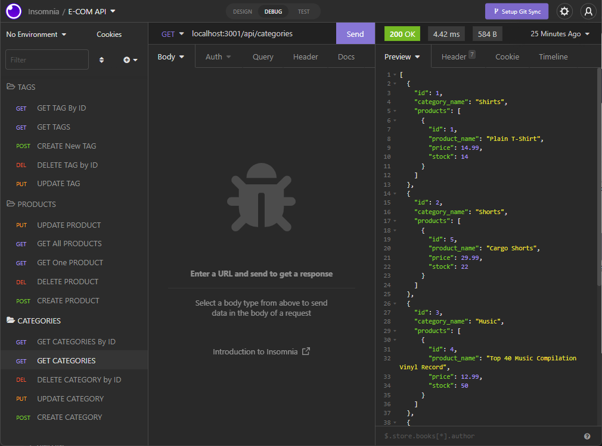

# E-COMMERCE API

# Description

The purpose of this project was to create the back end for an e-commerce site by configuring an Express.js API that uses Sequalize to interact with a MySQL database.

# Installation

To use this E-COM appliation you must install Node, Express, Sequalizer, and MySQL and clone the code from this repository into your own directory. Copy and or rename .env.EXAMPLE file to .env and enter your MySQL credentials.

Install Node: [Node.js](https://nodejs.org/en/download/).

Install Express: [Express.js](https://www.npmjs.com/package/express).

Install Sequalize: [Sequalize.js](https://www.npmjs.com/package/sequelize).

Install MySQL2 package: [MySQL2](https://www.npmjs.com/package/mysql2).

# Appearance

# Usage

Use this program as the bases for building an E-COMMERCE application database for managing inventory. This database includes the following module structures:

- Category

  - `id`

  - `category_name`

- Product

  - `id`

  - `product_name`

  - `price`

  - `stock`

  - `category_id`

- Tag

  - `id`

  - `tag_name`

- ProductTag

  - `id`

  - `product_id`

  - `tag_id`

## Link to video demonstration

Video: Setting up the schema and seeding the database: [GDrive Link](https://drive.google.com/file/d/1zxdFVp90ITOanxYmj1ZHRpE3QVs08C_j/view?usp=sharing)

Video: Testing API routes using Insomnia: [GDrive Link](https://drive.google.com/file/d/1k0BfFzAc2L6nen-bdYQ84Y5bGK9G5lgs/view?usp=sharing)

## Credits

Credits to Node.js, Express.js, Sequalize, MySQL.
